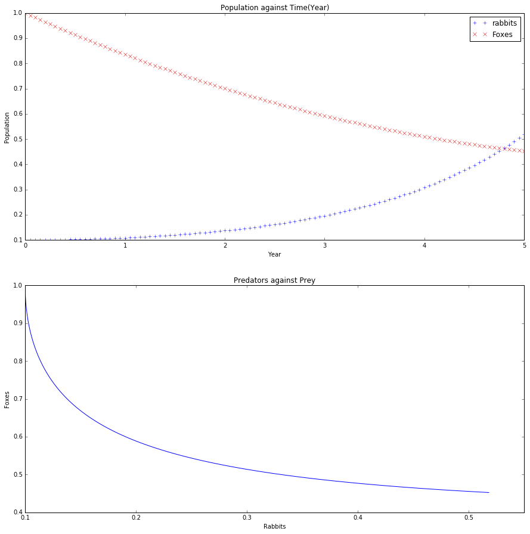
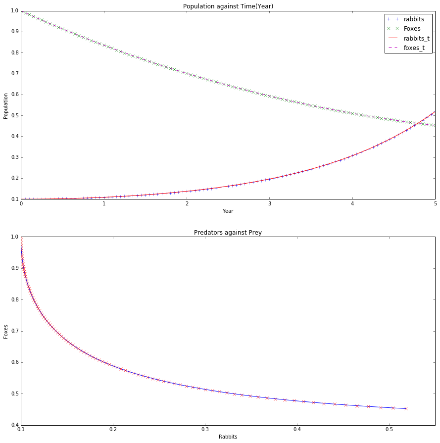

UECM3033 Assignment #3 Report
========================================================

- Prepared by: **Lem Wei Hao**
- Tutorial Group: T2

--------------------------------------------------------

## Task 1 --  Gauss-Legendre formula

The reports, codes and supporting documents are to be uploaded to Github at: 

[https://github.com/weihaolem/UECM3033_assign3](https://github.com/weihaolem/UECM3033_assign3)

Explain how you implement your `task1.py` here.

**In task1, I defined a function called gausslegendre() with four parameter which are integral function, lower boudary, upper boundary, and number of sample set in size 20. The function is based on the general form of a Gauss-Legendre quadrature formula:**

**At the result, we are compared between the exact value of integral function and value computed by using Gauss-Legendre quadrature method.**

Explain how you get the weights and nodes used in the Gauss-Legendre quadrature.

**Using built-in module `numpy.polynomial.legendre.leggauss(deg)` to produced the value of x and w which are sample points(nodes) and its weights. The result can be tested up to 100, higher degree might lead to problematic. The weights are determined by using the fact:**

**where where c is a constant independent of k and x_k is the k’th root of L_n, and then scaling the results to get the right value when integrating 1.**

---------------------------------------------------------

## Task 2 -- Predator-prey model

Explain how you implement your `task2.py` here, especially how to use `odeint`.

**On task2, It considered a closed biological system populated by number of prey and number of predators. I assumed the population with rabbits as prey, and foxes as predators. The task are required to solve the system of first order ODEs from 0 to 5 years. First I defined the function func() for the coupled differential equation,with y= [y0,y1], where y: population, y0:prey, y1:predators.**

**Inside the problem, there is given value of constant a=1.0, b=0.2, initial condition of y: y0=0.1, y1=1.0. After complete collected all needed variable, applied the Built-in module from FORTRAN library odepack and call `odeint` from `scipy.integrate`. `odeint` function are required 3 compulsory parameter which is function that computes derivative of y at t0, initial condition of y, and a sequence of time point for which solve for y. After solve ODEs, graph of population and graph of prey versus predators in plotted**

Put your graphs here and explain.

**From the graph of population against time, prey(rabbits) and predators(foxes) are move closer to each other as the year increases until intersection occured between 4th and 5th year. This mean after the intersection, population of rabbits are higher than population of its predators.**

**At the graph of prey versus predators, we see that the population of foxes(predators) decreased caused the population of rabbits(prey) increased without include other environment factors.**

Is the system of ODE sensitive to initial condition? Explain.

**Task required to make a minor change if initial condition for y, which is y0 increased from 0.1 to 0.11. The comparison graph is plotted above. rabbits_t and foxes_t are represent the new y0 and y1 respectively. From both graphs, we cannnot see much of gap of those line between new and original plot.**

**Therefore, the system of ODE are consider not sensitive to initial condition since minor change do not lead much effect to the original value.**

-----------------------------------

last modified: 17/04/2016
