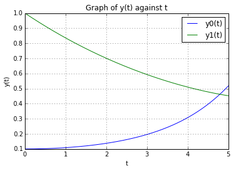
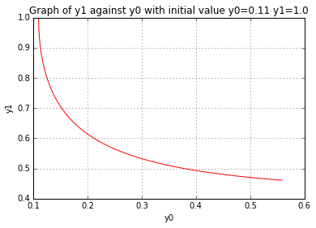

UECM3033 Assignment #3 Report
========================================================

- Prepared by: ** Foo Yee Sang**
- Tutorial Group: T2

--------------------------------------------------------

## Task 1 --  Gauss-Legendre formula

The reports, codes and supporting documents are to be uploaded to Github at: 

[https://github.com/YeeSang/UECM3033_assign3](https://github.com/YeeSang/UECM3033_assign3)

Explain how you implement your `task1.py` here.
Before we can apply the Gaussian quadrature rule, we have to change the interval from [a,b] to [-1,1] because the weights and nodes that used in Gauss-Legendre quadrature must came from the interval [-1, 1]. In the code the variable "x" represents the nodes and "w" represents the weight.
At last we compute the answer with:    ans = ((b-a)/2) * np.dot(y,w).

Explain how you get the weights and nodes used in the Gauss-Legendre quadrature.

The weights and nodes that used in the Gauss-Legendre quadrature can be obtained by the function in numpy module as the following command:
x,w = np.polynomial.legendre.leggauss(n)

---------------------------------------------------------

## Task 2 -- Predator-prey model

Explain how you implement your `task2.py` here, especially how to use `odeint`.

First we define a function called 'ode' to store the ode system. The function has four parameters which is y,t,a and b. The function will return the derivative of initial y with the equations: 
$$ y'_0 = a(y_0 - y_0 y_1)$$ $$ y'_1 = b(-y_1 + y_0 y_1)$$
And the initial value is defined as
$$ y_0 = 0.1 $$ $$y_1 = 1.0$$
The time t is defined from 0 to 5 years by using linspace function in numpy module.
Next we use the odeint function from scipy module to find the solution for the ode system and plot the graph with y(t) against t.

The graph as shown below:
 

The second part of this task is, we change the initial value y0 from 0.1 to 0.11 and observed the change in graphs.
The graph with initial value
$$y_0 = 0.1$$ $$y_1 = 1.0$$ is shown below:
 

and the graph with initial value
$$y_0 = 0.11$$ $$y_1 = 1.0$$ is shown below:
 

Is the system of ODE sensitive to initial condition? Explain.

No. The system of ODE is not sensitive to initial condition, we observed that there are no significant changes between the graphs when we change the initial condition.

-----------------------------------

last modified: 18/4/2016
